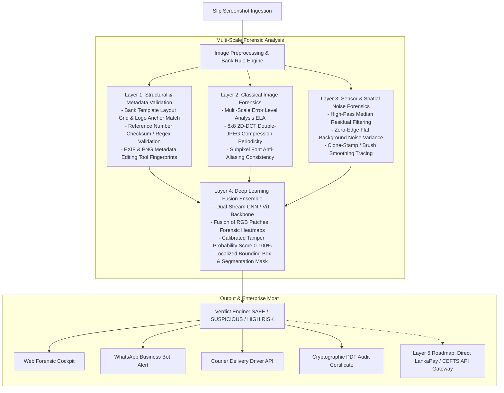

# VeriSlip — AI Forensic Detection Platform for Payment Slips & Invoices

[](https://github.com/chirana07/VeriSlip/actions)
[](https://www.python.org/downloads/)
[](https://fastapi.tiangolo.com/)
[](https://opensource.org/licenses/MIT)
[](https://github.com/chirana07/VeriSlip/issues)
[](https://github.com/chirana07/VeriSlip/pulls)

**VeriSlip** is an open-source AI forensic fraud detection platform and verification engine designed to detect digitally manipulated bank transfer slips, receipts, and invoices in peer-to-peer commerce, delivery logistics, and social media merchant ecosystems (Facebook Marketplace, Instagram DM sellers, WhatsApp Business, and COD courier operators).

---

## 🎯 The Problem

In informal and emerging digital commerce across South and Southeast Asia (Sri Lanka, India, Bangladesh, Philippines), millions of small merchants routinely release goods upon receiving a screenshot of a bank transfer slip (Commercial Bank, Sampath Vishwa, Bank of Ceylon, HNB, Nations Trust, etc.).

Fraudsters exploit this vulnerability by altering transaction amounts, reference numbers, or timestamps using photo editors (Photoshop, PicsArt, Canva) or HTML inspector mockups. Because these are high-frequency, low-to-medium value frauds, individual cases rarely get investigated by authorities, resulting in massive collective losses. **VeriSlip** solves this by providing automated, sub-3-second multi-scale forensic verification with exact red-box tamper localization.

---

## 🏛️ 5-Layer Forensic Architecture



---

## 🚀 Quickstart Guide

### Prerequisites
* Python 3.10 or higher
* Git

### 1. Installation
```bash
git clone https://github.com/chirana07/VeriSlip.git
cd VeriSlip

python3 -m venv venv
source venv/bin/activate
pip install -r requirements.txt
```

### 2. Run Test Suite
```bash
pytest tests/ -v
```

### 3. Launch Web Forensic Cockpit & API
```bash
python3 -m uvicorn api.main:app --host 127.0.0.1 --port 8000
```
Open **[http://127.0.0.1:8000](http://127.0.0.1:8000)** in your browser:
* **Interactive Cockpit:** Test authentic slips vs tampered amount forgeries in one click.
* **Forensic Visualizers:** Toggle between raw screenshot, ELA compression heatmap, noise residual map, and localized tamper bounding boxes.
* **WhatsApp Bot Simulator:** Experience the frictionless seller verification flow.
* **Unit Economics Calculator:** Interactive recurring revenue and volume calculator.

---

## 🗺️ Open Source Engineering Roadmap (100 Issues)

VeriSlip is developed as an open research and engineering initiative. We maintain a curated, prioritized roadmap of **100 issues** categorized across 4 domain tracks. We welcome contributions from computer vision researchers, machine learning engineers, and full-stack developers worldwide.

### Browse Issues by Domain Track

| Domain Track | Scope & Technologies | Issues Link |
| :--- | :--- | :--- |
| **🔬 Forensic Computer Vision** | Layer 1–3 algorithms: Bank templates, reference checksums, multi-scale ELA, 2D-DCT frequency analysis, copy-move detection, noise residuals (OpenCV, NumPy, SciPy). | [Browse `[FORENSICS-CV]` Issues](https://github.com/chirana07/VeriSlip/issues?q=is%3Aissue+is%3Aopen+label%3Adomain%3Acv-forensics) |
| **🧠 Machine Learning & Datasets** | Synthetic tampering engine, multi-tier attack simulation (Novice/Expert), PII redaction pipeline, Layer 4 PyTorch dual-stream fusion ensemble, ONNX runtime (PyTorch, Torchvision). | [Browse `[ML-DATA]` Issues](https://github.com/chirana07/VeriSlip/issues?q=is%3Aissue+is%3Aopen+label%3Adomain%3Aml-data) |
| **🌐 Backend Systems & APIs** | FastAPI production server, rate limiting, Meta WhatsApp Business Cloud API webhook, courier logistics API, WooCommerce/Shopify plugins, PDF audit report generator. | [Browse `[BACKEND-API]` Issues](https://github.com/chirana07/VeriSlip/issues?q=is%3Aissue+is%3Aopen+label%3Adomain%3Abackend-api) |
| **⚙️ Infrastructure & Research** | GitHub Actions CI/CD, Docker Compose, security & dual-use containment, merchant beta pilots, IEEE MERCon / ICTer research paper drafting. | [Browse `[INFRA-RESEARCH]` Issues](https://github.com/chirana07/VeriSlip/issues?q=is%3Aissue+is%3Aopen+label%3Adomain%3Ainfra-research) |

> 📖 **Full Backlog Documentation:** An exhaustive breakdown of all 100 issues with acceptance criteria is available in [docs/ISSUES_BACKLOG.md](docs/ISSUES_BACKLOG.md).

---

## 🤝 Contributing Guidelines

We actively encourage community pull requests! Follow these steps to contribute:

1. **Find an Issue:** Choose an issue from the [Issues Board](https://github.com/chirana07/VeriSlip/issues) matching your domain or search for `priority:low` / `priority:medium`.
2. **Fork & Branch:** 
   ```bash
   git checkout -b feature/issue-XX-description
   ```
3. **Implement & Test:** Ensure new features include unit tests in `tests/` and all existing tests pass:
   ```bash
   pytest tests/ -v
   ```
4. **Submit a Pull Request:** Open a PR against `main` referencing the issue number (e.g. `Fixes #42`). Our CI pipeline will automatically run test validations.

---

## 💡 Commercial & Monetization Strategy

VeriSlip is architected as an open-core commercial venture with multiple recurring revenue streams:

1. **WhatsApp Bot Micro-SaaS (B2C):**
   * Instant verification for social media sellers directly inside WhatsApp chat (<3s).
   * **Model:** 10 free verifications/month, followed by **LKR 1,490/month Pro pack** or LKR 10/check prepaid credits.
2. **Logistics & Courier Delivery API (High-Volume B2B):**
   * Mobile SDK and API for courier driver apps (Domex, Koombiyo, PromptX) verifying buyer deposit claims before package handover.
   * **Model:** **LKR 8.00 per API verification call**.
3. **Shopify & WooCommerce Auto-Verify Plugin:**
   * Automated verification of direct bank transfer slips uploaded by online shoppers ($29/month).
4. **Certified Forensic Audit Certificate:**
   * Cryptographically signed PDF evidence packs for police cybercrime complaints and bank disputes (LKR 1,500 / $5).
5. **Roadmap to Layer 5:**
   * Transition to an authorized LankaPay / CEFTS transaction verification gateway.

---

## 🔒 Ethics & Security Safeguards

* **Dual-Use Containment:** The synthetic tampering generation engine is strictly internal code for training data creation and unit testing; it is never exposed through public API endpoints or frontend interfaces.
* **Privacy & PII Protection:** Real customer financial details, names, and account numbers are automatically redacted, hashed, or synthesized before audit persistence.

---

## 📜 License

This project is licensed under the **MIT License** — see the [LICENSE](LICENSE) file for details.
