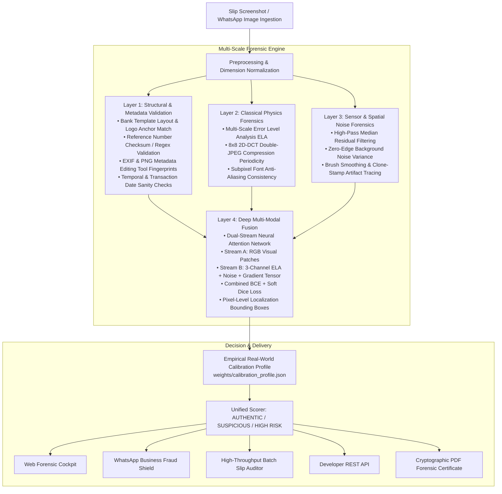

# VeriSlip — AI Forensic Detection Platform for Payment Slips & Invoices

[](https://github.com/chirana07/VeriSlip/actions)
[](https://www.python.org/downloads/)
[](https://pytorch.org/)
[](https://fastapi.tiangolo.com/)
[](https://github.com/chirana07/VeriSlip/actions)
[](https://opensource.org/licenses/MIT)
[](https://github.com/chirana07/VeriSlip/issues)
[](https://github.com/chirana07/VeriSlip/pulls)

**VeriSlip** is an enterprise-grade, open-source AI forensic fraud detection platform engineered to verify digitally manipulated bank transfer slips, receipts, and invoices in peer-to-peer commerce, social seller channels (WhatsApp Business, Instagram DMs, Facebook Marketplace), and last-mile COD courier logistics.

Combining classical physics-based image forensics, structural banking rule engines, and deep dual-stream convolutional neural attention networks, VeriSlip provides **sub-second automated fraud verdicts** with pixel-level tamper localization.

---

## 🎯 The Problem

In high-volume emerging digital commerce across South Asia (Sri Lanka, India, Pakistan, Bangladesh), merchants routinely release orders upon receiving a screenshot of a mobile bank transfer slip (Commercial Bank Q+, BOC SmartPay, Sampath WePay/Vishwa, HNB SOLO, FriMi, Seylan Pay).

Fraudsters exploit this by doctoring amounts, transaction reference numbers, or beneficiary details using Canva, Photoshop, PicsArt, or HTML DOM inspection tools. Because individual losses are often below police investigation thresholds, cumulative merchant losses are staggering.

**VeriSlip** solves this by providing a multi-layer defense that catches even expertly edited, recompressed slips that fool human eyes.

---

## 🏛️ 4-Layer Defense-in-Depth Architecture



---

## ✨ Key Platform Capabilities

### 1. Web Forensic Cockpit
An interactive commercial dashboard for real-time slip analysis with side-by-side zoomable overlays, ELA heatmaps, noise variance charts, and red-box tamper coordinates.

### 2. WhatsApp Business Fraud Shield
Webhook integration for messaging bots that intercepts slips sent by buyers, verifies authenticity in `<2.5` seconds, and automatically responds with safe-to-dispatch recommendations.

### 3. Batch Slip Auditor
Enterprise file triage capable of analyzing hundreds of slips concurrently for end-of-day finance reconciliation, filtering high-risk transfers into CSV audit reports.

### 4. Zero-Label Kaggle Training Pipeline
Automated synthetic generation engine producing paired authentic and tampered banking receipts across all major Sri Lankan banks with pixel-perfect ground-truth binary masks—**zero manual drawing or annotation required**.

### 5. Few-Shot Real Slip Calibration
Empirical calibration engine (`scripts/calibrate_real_slips.py`) that tunes layer weights and sensitivity thresholds using as few as 3–10 real screenshots from genuine merchant traffic, eliminating false alarms.

---

## 🚀 Quickstart Guide

### Prerequisites
* Python 3.10 or 3.11
* Git

### 1. Installation
```bash
git clone https://github.com/chirana07/VeriSlip.git
cd VeriSlip

python3 -m venv venv
source venv/bin/activate
pip install -r requirements.txt
```

### 2. Run Comprehensive Test Suite
```bash
pytest tests/ -v
```
*(All 16 unit tests covering API endpoints, generators, and Layers 1–4 pass out-of-the-box.)*

### 3. Launch the Server
```bash
python3 -m uvicorn api.main:app --host 127.0.0.1 --port 8000 --reload
```
Open **[http://127.0.0.1:8000](http://127.0.0.1:8000)** in your browser to access the Web Forensic Cockpit.

---

## 🧠 Model Training & Few-Shot Calibration

### A. Training on Kaggle GPU (Zero Manual Labeling)
1. Generate the synthetic benchmark dataset locally:
   ```bash
   VERISLIP_ENABLE_SYNTHETIC_GENERATOR=1 python3 scripts/generate_kaggle_dataset.py --samples 2000
   ```
   Outputs `verislip_kaggle_dataset.zip` containing 4,000 paired authentic & tampered images with binary segmentation masks.
2. Upload the zip to [Kaggle Datasets](https://www.kaggle.com/datasets).
3. Open [`notebooks/VeriSlip_DualStream_Training.ipynb`](notebooks/VeriSlip_DualStream_Training.ipynb) in Kaggle Notebooks, select **GPU T4 x2**, and click **Run All**.
4. Download `verislip_dualstream_best.pt` using the one-click download cell and move it to `weights/`:
   ```bash
   mv ~/Downloads/verislip_dualstream_best.pt weights/
   ```

### B. Few-Shot Real Slip Calibration
To eliminate false alarms on real-world phone screenshots and WhatsApp recompression:
1. Place 3 to 10 real bank transfer screenshots in `datasets/real_calibration/authentic/` *(strictly ignored by git to protect financial privacy)*.
2. Run the calibration script:
   ```bash
   python3 scripts/calibrate_real_slips.py
   ```
3. VeriSlip automatically tunes layer fusion weights and writes `weights/calibration_profile.json`.

---

## 🔌 Developer REST API

### 1. Single Slip Verification
```bash
curl -X POST http://127.0.0.1:8000/api/v1/verify \
  -F "file=@/path/to/slip.jpg" \
  -F "bank_code=COMBANK"
```

**Response:**
```json
{
  "verdict": "HIGH_RISK_TAMPERED",
  "verdict_color": "#EF4444",
  "tamper_risk_percentage": 90.0,
  "confidence_score": 0.8,
  "calibration_profile": "Active (Empirical Real-World Profile)",
  "flagged_regions": [
    {
      "box": [150, 315, 232, 28],
      "confidence": 1.0,
      "label": "Neural Localization Anomaly"
    }
  ],
  "recommendation": "High probability of digital tampering. DO NOT ship goods on this slip alone."
}
```

### 2. WhatsApp Webhook
```bash
curl -X POST http://127.0.0.1:8000/api/v1/webhook/whatsapp \
  -H "Content-Type: application/json" \
  -d '{
    "from_phone": "+94771234567",
    "image_base64": "<base64_encoded_slip>",
    "caption": "Customer sent this slip for order #1082"
  }'
```

---

## 🗺️ Open-Source Roadmap & Backlog

VeriSlip is developed as an open-core research initiative. Browse open issues on our [GitHub Issues Board](https://github.com/chirana07/VeriSlip/issues):

| Domain Track | Scope & Technologies | Status |
| :--- | :--- | :--- |
| **🔬 Computer Vision & Signal Forensics** | Bank layout templates, reference checksums, ELA, 2D-DCT frequency analysis, copy-move detection, noise residuals (OpenCV, NumPy, SciPy). | 14 Done / 14 Open |
| **🧠 Machine Learning & Datasets** | Synthetic tampering engine, PII redaction pipeline, PyTorch dual-stream CNN fusion, Kaggle training pipeline, few-shot calibration. | 16 Done / 12 Open |
| **🌐 Backend Systems & APIs** | FastAPI server, WhatsApp Business Cloud API webhook, courier logistics API, batch verification, PDF report generation. | 12 Done / 14 Open |
| **⚙️ Infrastructure & Research** | GitHub Actions CI/CD (Python 3.10 & 3.11), Docker Compose, security/dual-use containment, merchant pilot studies, research paper drafting. | 6 Done / 12 Open |

> 📖 **Full Backlog Documentation:** See [docs/ISSUES_BACKLOG.md](docs/ISSUES_BACKLOG.md) for detailed descriptions, acceptance criteria, and architecture notes.

---

## 🤝 Contributing

Contributions from computer vision researchers, ML engineers, and software developers are warmly welcomed!

1. Fork the repository and create a branch:
   ```bash
   git checkout -b feature/your-feature-name
   ```
2. Implement your changes, following PEP 8 conventions.
3. Ensure all tests pass:
   ```bash
   pytest tests/ -v
   ```
4. Submit a Pull Request referencing the corresponding issue.

---

## 🔒 Security & Dual-Use Policy

* **Dual-Use Containment:** The synthetic tampering generation engine lives under `core/internal/` for offline training, calibration, and unit tests. It is not mounted by the API or exposed by the frontend. The engine is disabled by default and construction fails unless an authorized offline process explicitly sets `VERISLIP_ENABLE_SYNTHETIC_GENERATOR=1`. Never set this flag in a public API deployment.
* **Safe Image Ingestion:** Public verification endpoints identify JPEG/PNG inputs from their actual encoded content, cap upload bytes and decoded dimensions, fail closed on Pillow decompression-bomb warnings, reject malformed/truncated/animated or unsupported images, and pass only normalized metadata-free RGB pixels into forensic analysis.
* **Request Tracing:** Every API response includes `X-Request-ID`. Callers may provide a safe `X-Request-ID` or `X-Correlation-ID`; otherwise VeriSlip generates a UUID. Request lifecycle logs are JSON records containing the correlation ID, route template, status, and duration—never request bodies, uploaded receipts, query strings, credentials, or authorization headers.
* **API Access Control:** `/api/v1` endpoints require an `X-API-Key`. Configure only SHA-256 key fingerprints through `VERISLIP_API_KEY_HASHES`; raw production keys never belong in source or environment configuration. Free keys receive 10 requests/day and pro keys receive 100 requests/minute. Health, documentation, OpenAPI, static assets, and the web root remain public. `REDIS_URL` enables distributed counters; local development falls back to an in-memory store.
* **Privacy by Design:** Personal account numbers, customer names, and bank account identifiers are automatically masked or sanitized before audit log persistence.
* Real calibration slips placed in `datasets/real_calibration/` are protected by `.gitignore` rules and never tracked.

---

## 📜 License

This project is licensed under the **MIT License** — see the [LICENSE](LICENSE) file for details.
