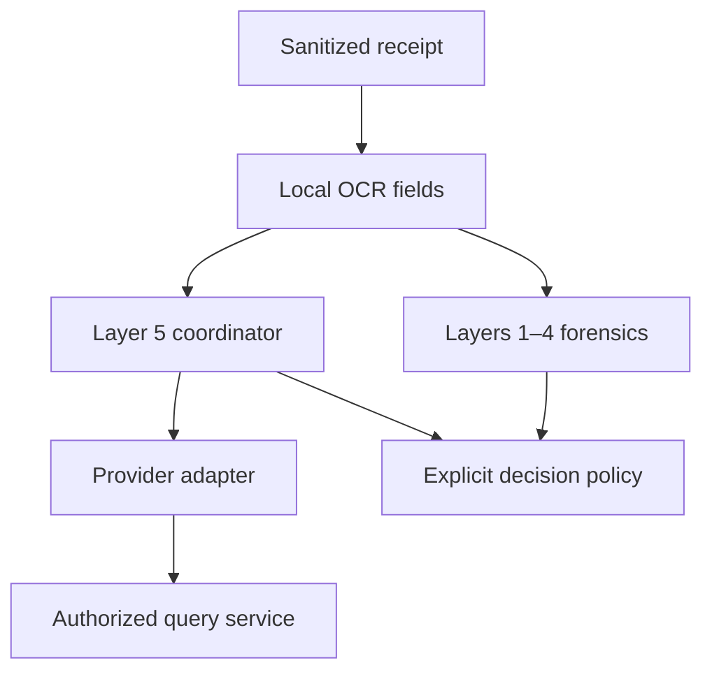
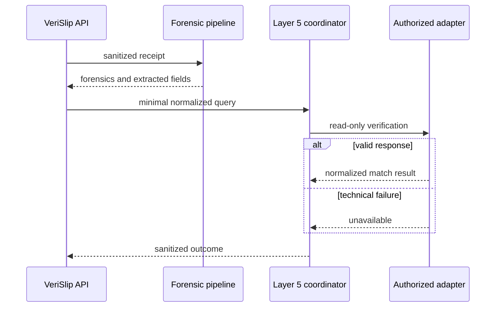
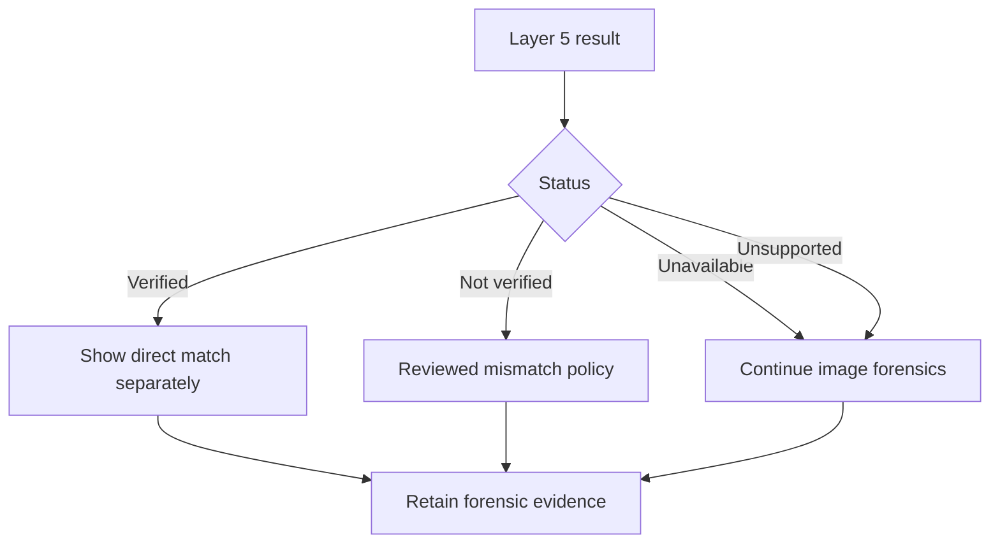

# Layer 5 direct transaction-verification roadmap

## 1. Executive summary

Layer 5 is a proposed **read-only** verification capability. An authorized
VeriSlip deployment could ask an approved LankaPay/CEFTS participant, LankaPay,
or a participating bank whether a claimed transfer matches a real transaction.
It complements image forensics; it does not replace them, move money, or turn
provider downtime into a fraud verdict.

No public, authoritative CEFTS transaction-query API specification was found in
the research performed for issue #100 on 2026-10-03. This document therefore
defines a provider-neutral VeriSlip boundary, not a LankaPay wire protocol.

## 2. Evidence labels

- **Verified fact:** supported by a public LankaPay or CBSL source below.
- **Proposal:** a VeriSlip design decision.
- **Partner confirmation required:** needs authorized partner documentation.
- **Development mock:** synthetic, local-only behavior with no network access.

## 3. Current VeriSlip architecture

The existing path sanitizes a receipt, extracts local OCR fields, runs Layers
1–4, optionally cross-checks LankaQR, and stores minimal history metadata. API
keys, rate limits, correlation IDs, structured logs, background jobs, and PII
scrubbing already exist and should wrap future Layer 5 adapters.

Issue #116 added `core/integrations/lankapay_cefts.py` and
`POST /api/v1/clearing/cefts/query`. Repository inspection confirms it is a
deterministic in-memory ledger: it makes no external request, has no partner
credentials, and is neither an official LankaPay sandbox nor a production CEFTS
integration. Its historical ISO-like fields and response codes must not be
treated as official. Issue #100 labels it clearly while preserving compatibility.

## 4. Why Layer 5 is useful

Image analysis estimates whether receipt pixels and content appear authentic.
An authorized query could independently establish whether a reference exists and
whether approved fields match. These signals answer different questions and
must remain separately visible.

## 5. Scope and non-goals

Layer 5 is only a read-only verification query. It must never initiate, reverse,
route, clear, or settle a payment; modify bank records; scrape consumer internet
banking; automate bank portals; bypass authentication; or expose credentials,
provider payloads, or unnecessary PII. It must not claim access to a network or
sandbox without written authorization.

## 6. Publicly verified LankaPay/CEFTS information

As of the research date:

1. **Verified fact:** CBSL says CEFTS is operated by LankaClear (Pvt) Ltd under
   National Payments Council recommendation and CBSL approval. It supports
   online real-time transfers between members through channels including ATMs,
   mobile phones, and internet banking.
2. **Verified fact:** CBSL states customer accounts are credited in real time,
   while interbank settlement occurs in two RTGS cycles each business day.
   “Credited,” “accepted,” and “settled” must not be invented as synonyms.
3. **Verified fact:** LankaPay describes a financial-institution web application
   for near-real-time monitoring and reconciliation reports, net-position
   monitoring, dispute management, access levels, and 24/365 support.
4. **Verified fact:** LankaPay's business page describes transfers between member
   institutions up to LKR 5 million, 24/7/365, and says CEFTS is supervised by
   CBSL and follows PCI-DSS 3.2.
5. **Verified fact:** CBSL identifies the Payment and Settlement Systems Act No.
   28 of 2005 in the legal framework and publishes a FinTech sandbox framework.

The reviewed public pages do **not** document a merchant transaction-query API,
endpoint URL, payload, authentication scheme, certificate profile, reason-code
catalogue, rate limit, SLA, or sandbox enrollment procedure.

### Public sources

- CBSL, *Payments and Settlements Systems*:
  https://www.cbsl.gov.lk/en/financial-system/financial-infrastructure/payments-and-settlements-systems
- CBSL, *Fast Payments for Everyone — CEFTS Implementation in Sri Lanka*:
  https://www.cbsl.gov.lk/en/node/18163
- LankaPay, *Real Time Payments — Financial Institutions*:
  https://www.lankapay.net/en/for-financial/real-time-payments-cefts
- LankaPay, *Real Time Payments — Business*:
  https://www.lankapay.net/en/for-business/real-time-payments-cefts

These are research references, not access permission or API documentation.

## 7. Unknowns requiring partner confirmation

An authorized partner must confirm whether a query product exists; who may use
it; whether access is direct, bank-mediated, or report-based; onboarding and
regulatory prerequisites; sandbox availability; transport and credential rules;
permitted identifiers; consent/ownership rules; exact field/status definitions;
idempotency and freshness; rate limits and SLAs; error semantics; retention and
display permissions; dispute handling; incident reporting; and key rotation.

No implementation should guess these answers.

## 8. Proposed provider abstraction

`TransactionVerificationProvider` exposes `supports(request)` and
`verify_transaction(request)`. Future authorized CEFTS, participating-bank, and
partner-sandbox adapters can implement it without coupling forensic code to a
wire format. Provider payloads are translated inside adapters and never returned
raw. The synchronous domain boundary may execute in existing workers while a
real adapter uses a suitable bounded HTTP client internally.

## 9. Verification request model

| Field | Local requirement | Partner confirmation |
|---|---|---|
| Transaction/reference identifier | Mandatory | Meaning/queryability |
| Amount in integer minor units | Optional | Availability and precision |
| Currency | Mandatory locally, default LKR | Supported values |
| Recipient/account identifier | Optional and transient | Format and permission |
| Merchant identifier | Optional and transient | Registration/mapping |
| Transaction date | Optional | Precision and query window |
| Bank/provider code | Optional routing hint | Code scheme |

Floating-point amounts are prohibited at this boundary. OCR confidence and raw
receipt content are never provider inputs.

## 10. Verification result model

Results use `VERIFIED`, `NOT_VERIFIED`, `UNAVAILABLE`, or `UNSUPPORTED`.
Individual comparisons use `MATCH`, `MISMATCH`, or `NOT_CHECKED`. A normalized
result may include provider alias, safe reason code, UTC verification time, and
an opaque provider reference only when disclosure is permitted.

`UNAVAILABLE` and `UNSUPPORTED` are operational states—not fraud. Real partner
semantics must distinguish not-found, mismatch, pending/freshness windows, and
settlement states before those outcomes affect business decisions.

## 11. Proposed sequence

## 12. API/interface design

Issue #100 does not add a production public endpoint. The repository already has
a legacy mock endpoint; adding another before partner semantics are known would
freeze invented fields into a contract. A future endpoint should use existing
API-key/rate-limit middleware, return only normalized results, and use existing
background jobs if authorized-provider latency exceeds the synchronous budget.

## 13. Security architecture

- Place adapters in an outbound-only, least-privilege network segment.
- Configure allow-listed destinations; never accept a provider URL from a request.
- Inject secrets through a managed store, not source or request parameters.
- Separate development, sandbox, pilot, and production identities/trust stores.
- Strictly validate schemas and cap response sizes before parsing.
- Encrypt permitted data and define credential rotation/revocation.
- Authorize merchants only for identities/accounts they are entitled to query.
- Threat-model enumeration, replay, SSRF, spoofed responses, insiders, and theft.

## 14. Authentication and credentials

mTLS, OAuth client credentials, signed requests, private connectivity, and API
keys are possible enterprise patterns, but **none is asserted as a LankaPay
requirement**. A real adapter must follow authorized specifications. Logs and
exceptions must never contain tokens, keys, certificates, signatures, or
authorization headers. Private keys should be non-exportable where practical.

## 15. Privacy and data minimization

Only contractually required fields may leave VeriSlip. Account/recipient values
remain transient and can be fingerprinted when a comparison token is sufficient.
Persist only normalized outcome, safe reason, provider alias, verification time,
policy version, and an allowed opaque correlation ID for the minimum retention.

Never store raw provider payloads by default or log full references, accounts,
names, receipt pixels, query payloads, or secrets. Complete a Sri Lankan legal,
regulatory, privacy, retention, access, and deletion review before a pilot.

## 16. Failure handling and resilience

Adapters need separate connect/read deadlines, bounded responses, strict parsing,
and a circuit breaker. Treat DNS/TLS errors, timeouts, throttling, malformed data,
and 5xx responses as `UNAVAILABLE` unless official semantics say otherwise.
Retry only partner-approved transient failures with jitter, an idempotent query
key, and a strict attempt cap. Never retry authentication/schema failures blindly.

## 17. Forensic fallback

Image forensics continues when Layer 5 is disabled, unconfigured, unsupported,
timed out, or down. During rollout, direct and forensic results stay separate;
technical failure never becomes “fraudulent.”

## 18. Observability

Record bounded duration, provider alias, normalized status, retry count, breaker
state, and request correlation ID. Measure latency, availability, timeouts, schema
failures, and outcome counts. Never use transaction/account identifiers as metric
labels. Store provider correlation IDs only when approved and access-controlled.

## 19. Mock/sandbox strategy

`DevelopmentMockProvider` is opt-in, deterministic, and initialized only with
synthetic records. It has no URL or credential configuration and stores recipient
values as SHA-256 comparison fingerprints. It tests VeriSlip domain behavior; it
does not emulate LankaPay fields, codes, timing, authentication, or settlement.

## 20. Testing strategy

Unit tests cover matches, amount/recipient/reference mismatches, unsupported
banks, timeout/unavailability, malformed responses, fallback, input validation,
mock opt-in, and log redaction. Partner work later needs contract tests using
approved fixtures, authorized sandbox tests, TLS/rotation tests, load limits,
chaos testing, and joint reconciliation review. Tests must never call production.

## 21. Deployment roadmap

### Phase A — neutral foundation and mock

Review the domain contract, deterministic mock, privacy model, fallback, and
legacy mock labeling. Exit only when tests are synthetic and no network exists.

### Phase B — partner discovery and authorized sandbox

Obtain written specifications and permission; confirm eligibility, fields,
statuses, retention, security, and support. Implement a separate adapter. Use a
sandbox only if the partner confirms and grants one. Exit after contract review.

### Phase C — security and compliance validation

Complete architecture, privacy, legal, penetration, credential, resilience,
logging, deletion, incident, and audit reviews. Exit with written approvals.

### Phase D — limited merchant pilot

Allow-list institutions/merchants, use low quotas and kill switches, and begin in
shadow/separate-result mode. Measure mismatch, availability, latency, and dispute
outcomes. Exit with an approved pilot and tested rollback.

### Phase E — controlled production rollout

Gradually expand with SLOs, on-call ownership, key rotation, disaster recovery,
periodic access/privacy reviews, forensic fallback, and provider kill switches.

## 22. Partner onboarding, risks, and open questions

Required artifacts include authorized specifications, contracts/data terms,
legal approvals, security contacts, credentials/trust material, permitted test
data, schemas/status semantics, rates/SLAs, escalation paths, retention rules,
and signed go-live approval.

Key risks are false confidence, false mismatches from normalization/freshness,
privacy leakage, enumeration, outages, ambiguous settlement semantics,
credential compromise, and mistaking a mock for protocol evidence.

Open questions include who may query, data-controller roles, whether the target
state is credited or settled, how merchant ownership is proven, authoritative
identifiers, freshness windows, automated-decision limits, and dispute handling.
Resolve them with LankaPay/CBSL/participating institutions—not by inference.
