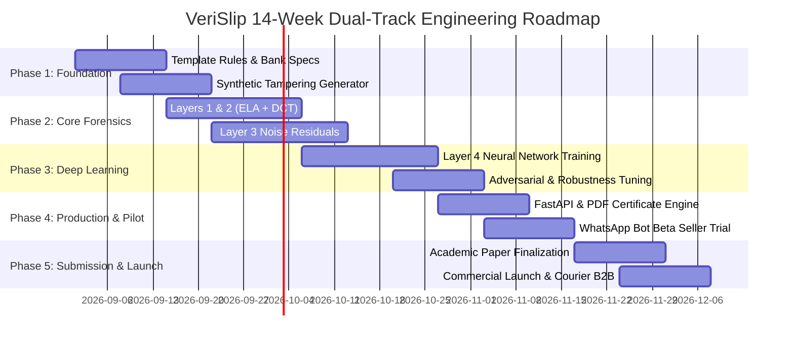

# VeriSlip: Internal Team Organization, Research Roadmap & Venture Financials

This document contains the internal project architecture, 3-person engineering division, academic deliverables, and business monetization blueprint for the **VeriSlip** platform.

---

## 1. 3-Person Core Engineering Division

Consolidated from the initial 6-role enterprise blueprint into 3 high-impact, independent pillars ensuring rapid velocity and distinct academic contributions.

### Person 1: AI & Forensic Computer Vision Lead
* **Primary Scope:** Classical Forensic Signal Processing & Spatial Frequency Analysis (Layers 1, 2, and 3).
* **Core Modules:**
  - `core/forensics/layer1_structural.py`: Bank template visual matching, aspect ratio validation, EXIF editing software signature detection.
  - `core/forensics/layer2_classical.py`: Error Level Analysis (ELA) with adaptive difference amplification, 2D Discrete Cosine Transform (DCT) block periodicity analysis, font Laplacian edge variance.
  - `core/forensics/layer3_noise.py`: High-pass spatial noise residual extraction, edge-masked block variance mapping, splicing discontinuity detection.
* **Research Paper Contribution:**
  - Empirical characterization and signal difference between mobile digital UI screenshots vs camera-captured document images.
  - Frequency-domain and noise-floor sensitivity benchmarks under multi-generation social messaging compression (WhatsApp/Messenger).

### Person 2: Deep Learning & Data Engineering Lead
* **Primary Scope:** Synthetic Tampering Engine, Forensic Fusion Neural Networks & Dataset Governance (Layer 4).
* **Core Modules:**
  - `core/ml/dataset_generator.py`: Synthetic generator producing realistic paired authentic and tampered slip images with ground-truth bounding box masks and multi-tier tampering levels (obvious, intermediate, skilled doctoring).
  - `core/ml/ensemble_model.py`: PyTorch `DualStreamForensicNetwork` featuring cross-modal spatial attention gating, classification MLP, and convolutional segmentation decoder for localization.
  - `core/forensics/ocr_extractor.py`: Color histogram and structural template recognition for automated bank classification and layout coordinate parsing.
* **Research Paper Contribution:**
  - Novel dual-stream feature fusion architecture combining spatial RGB cues with a 3-channel forensic tensor (ELA + Noise + DCT Energy).
  - Benchmark evaluation against state-of-the-art document forgery datasets (CASIA, Coverage, DocTamper).

### Person 3: Full-Stack Engineering, Infrastructure & GTM Lead
* **Primary Scope:** Production API, Web Cockpit, WhatsApp Business Gateway, PDF Authority, and Venture Strategy.
* **Core Modules:**
  - `api/main.py` & `api/routes/verify.py`: High-performance FastAPI server supporting single and batch verification with sub-1.5s latency.
  - `api/routes/reports.py`: Cryptographically signed vector PDF audit certificate generator using ReportLab with SHA-256 document hashing.
  - `api/routes/webhook_whatsapp.py`: Frictionless WhatsApp bot webhook simulating immediate receipt verification for merchants.
  - `web/`: Modern, glassmorphic Forensic Cockpit, High-Throughput Batch Slip Auditor, and interactive testing interface.
* **Venture & Academic Contribution:**
  - Production deployment, merchant pilot trials across 20+ active Sri Lankan Instagram/Facebook Marketplace sellers, real-world false-positive tuning, and legal dispute admissibility framework.

---

## 2. 14-Week Dual-Track Roadmap

### Detailed Milestone Breakdown

| Milestone | Timeframe | Deliverables & Exit Criteria | Owner |
| :--- | :--- | :--- | :--- |
| **M1: Architecture & Rules** | Weeks 1–2 | Bank templates defined (ComBank, Sampath, BOC, HNB, Seylan, FriMi), reference regex validated, Git repository skeleton initialized. | Person 1 & 3 |
| **M2: Synthetic Data Engine** | Weeks 3–4 | Synthetic generator producing 1,000+ authentic/tampered image pairs with labeled ground-truth bounding box coordinates. | Person 2 |
| **M3: Classical Forensics** | Weeks 4–6 | ELA and DCT frequency algorithms implemented, noise residual extraction functional, baseline accuracy > 85% on synthetic sets. | Person 1 |
| **M4: Deep Learning Ensemble** | Weeks 6–8 | Dual-stream PyTorch model trained on combined RGB + forensic tensors, localization decoder validated, ensemble weights tuned. | Person 2 |
| **M5: Production Backend & PDF** | Weeks 9–10 | FastAPI endpoints `/verify`, `/batch-verify`, `/report/audit-pdf` live with sub-1.5s response times; cryptographic PDF generation tested. | Person 3 |
| **M6: Pilot Trial & WhatsApp** | Weeks 11–12 | WhatsApp webhook connected, pilot testing with 20 social commerce sellers, false-positive threshold calibration. | Person 3 & 1 |
| **M7: Academic Submission** | Weeks 13–14 | Complete conference paper manuscript (e.g. IEEE MERCon / ICTer), public open-source benchmark dataset released, enterprise B2B outreach. | All Members |

---

## 3. Financial Unit Economics & Venture Monetization

### Market Opportunity (Sri Lanka & South Asia P2P Commerce)
* Over **70,000 active social commerce sellers** on Instagram, TikTok, and Facebook Marketplace in Sri Lanka rely on bank wire screenshots before releasing goods.
* **Fake Payment Slip Fraud** costs merchants and delivery riders an estimated **LKR 180M+ annually** through altered transfer amounts and fabricated CEFTS reference numbers.
* Delivery companies (Domex, Koombiyo, PromptX, Fardar) face significant cash-on-delivery and direct-deposit fraud disputes when customers display spoofed slips to courier dispatchers.

### Revenue Streams

1. **B2C Social Seller Micro-SaaS (WhatsApp Bot):**
   * Freemium: First 15 checks free per month.
   * Pro Plan: **LKR 1,490 / month** (~$4.90 USD) for 250 slip verifications, priority webhook queue, red-box tamper images, and PDF dispute certificates.
   * Target: 1,500 active subscribers by Month 6 = **LKR 2,235,000 / month**.

2. **B2B Courier & Fleet Verification API:**
   * High-volume REST API integrated into rider mobile dispatch apps.
   * **LKR 6.50 – 8.00 per API verification call**.
   * Tiered volume: 100,000 deliveries/month across 2 courier partners = **LKR 750,000 / month**.

3. **Certified Legal Forensic Audit Certificate:**
   * **LKR 1,500 per report** for official dispute evidence packs required by police cybercrime divisions and commercial bank fraud investigations.

4. **E-Commerce Checkout Auto-Verification (Shopify & WooCommerce Plugin):**
   * **$29 / month** fixed fee for online stores accepting bank transfer slip uploads. Automatically updates order status to "Processing / Paid" upon verified slip submission.

### Cost Structure & Gross Margins
* **Server Hosting & Compute:** ~$120 USD/month (FastAPI instance + CPU inference; classical forensics and lightweight PyTorch dual-stream model require zero costly GPU instances in production).
* **WhatsApp Cloud API:** ~$80 USD/month.
* **Gross Margin:** **> 88% software gross margin**.
