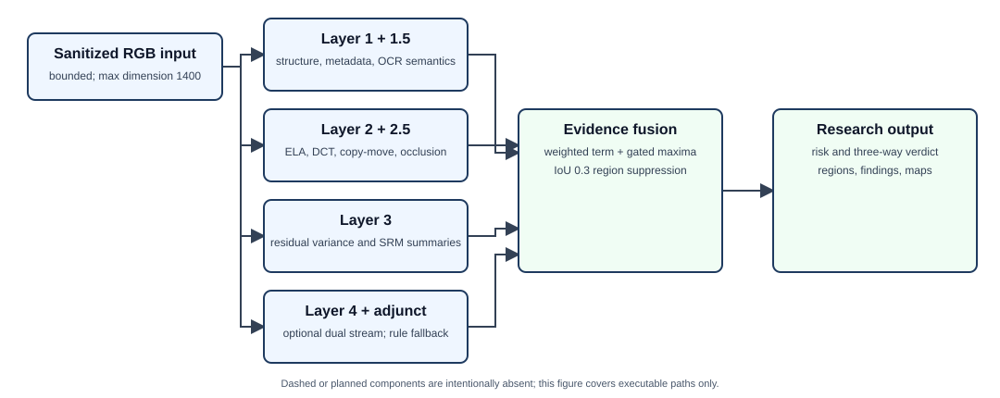

# VeriSlip multi-layer methodology

## Reproducibility statement

This methodology is derived from the implementation on the issue #95 base
commit. It describes executable behavior, including fallbacks and fixed
thresholds; it does not imply that those thresholds are empirically calibrated.
The architecture figure is regenerated deterministically with:

```cmd
python scripts\generate_research_architecture.py
```



## Input and preprocessing

Externally supplied files are decoded by the shared sanitizer before the
forensic engine. Accepted raster data is content-validated, bounded by encoded
size and dimensions, decoded fully, detached from its source stream, converted
to RGB, and stripped of metadata during canonical re-encoding. Within
`VeriSlipForensicEngine.analyze`, the longest image dimension is reduced to at
most 1400 pixels and the image is converted to RGB:

\[
I = \operatorname{RGB}(\operatorname{resize}_{\max(H,W)\leq1400}(I_0)).
\]

The engine copies already-decoded image metadata before conversion because
Layer 1 evaluates it. Coordinates returned by all layers refer to this normalized
analysis image, not necessarily the original upload dimensions.

## Layer 1: structural and metadata validation

### Inputs and features

Layer 1 receives \(I\), an optional bank code, and an optional reference number.
It evaluates:

- decoded metadata for editing-software indicators;
- image aspect ratio and bank-specific dominant-color similarity;
- reference-number format when a reference is supplied;
- a document quadrilateral and optional perspective rectification result.

Perspective rectification is exposed to consumers, but structural scoring uses
the source analysis image so that a warp does not remove metadata or alter color
evidence.

### Score

With binary indicators \(m\) (suspicious metadata), \(a\) (non-standard phone
aspect), \(c\) (color match below 0.6), and \(r\) (invalid supplied reference),
the implemented score is

\[
s_1=\min(1,\;0.45m+0.15a+0.20c+0.40r).
\]

Layer 1 marks an anomaly at \(s_1\geq0.40\). Its output includes score, findings,
metadata/layout/reference analysis, and perspective information. Metadata and
layout are weak evidence: exports, screenshots, and bank redesigns can create
legitimate differences.

## Layer 1.5: OCR semantic validation

Local OCR produces tokens with text and bounding boxes. No cloud OCR call is
required. The semantic validator checks malformed currency grouping, the
relation

\[
\left|\operatorname{totalDebit}-(\operatorname{amount}+\operatorname{fee})\right|
>0.05,
\]

receipt generation more than 30 seconds before the stated transaction, and a
small set of bank-specific mandatory fields. Each rule supplies a fixed
confidence; the layer score is the maximum issue confidence,

\[
s_{1.5}=\max_{j\in\mathcal{J}}q_j,
\]

or zero for no issues. The anomaly threshold is 0.70. Outputs include issue
descriptions and OCR-derived regions. Missing or erroneous OCR can suppress or
create evidence; OCR text is not treated as bank truth.

## Layer 2: classical image forensics

### Error-level analysis

The RGB analysis image is re-encoded in memory as JPEG at quality \(Q=90\). For
original pixel \(I(p,c)\) and recompressed pixel \(J_Q(p,c)\), the implementation
forms

\[
D(p,c)=|I(p,c)-J_Q(p,c)|,
\qquad D_g=\operatorname{gray}(D).
\]

The visualization clips \(18D\) to the 8-bit range. The scalar ELA statistic is
\(v_{ELA}=\operatorname{Var}(D_g)\). A YCrCb decomposition also reports

\[
\rho_{YC}=\frac{\operatorname{Var}(Y_D)}{
(\operatorname{Var}(Cr_D)+\operatorname{Var}(Cb_D))/2+10^{-4}}.
\]

ELA is a recompression-difference heuristic, not an authenticity proof or a
calibrated probability.

### DCT periodicity and JPEG grids

For each complete 8-by-8 grayscale block after subtracting 128, the code applies
a 2-D DCT and collects coefficients \((1,2)\) and \((2,1)\). It constructs a
100-bin histogram over \([-50,50]\), removes the mean, and computes its real FFT.
The implemented periodicity score is

\[
p=\frac{\max_{k\geq3}|\mathcal{F}(h-\bar h)_k|}
{\sum_k|\mathcal{F}(h-\bar h)_k|+10^{-5}},
\qquad s_{DCT}=\min(1,4p).
\]

Grid analysis compares average adjacent-pixel discontinuities at each phase
modulo eight. Regional block-artifact-grid analysis flags a local phase separated
from the global phase by at least two pixels when its strength crosses the
targeted or blind-scan threshold.

### Localization, copy--move, and auxiliary evidence

ELA regions are thresholded relative to global difference statistics and then
filtered by area. Copy--move analysis combines ORB keypoint/translation clusters
with dense overlapping block-DCT matching. Layer 2 also invokes screen-recapture,
thermal-fade, block-grid, and local edge evidence. A separate Layer 2.5 detects
occlusion-like rectangular patches. These mechanisms return candidate regions
and findings as well as scalar anomalies. Repeated glyphs, UI dividers, uniform
backgrounds, and benign recompression are important confounders.

The final Layer 2 score is an implementation-specific rule combination found in
`Layer2ClassicalForensics.evaluate`; it must be treated as a bounded heuristic,
not as a posterior probability.

## Layer 3: noise-residual consistency

The grayscale image \(G\) is median-filtered with a 3-by-3 kernel and the
absolute residual is

\[
R=|G-\operatorname{median}_{3\times3}(G)|.
\]

The image is partitioned into non-overlapping 32-by-32 blocks. For block \(b\),
the code computes \(v_b=\operatorname{Var}(R_b)\) and Canny edge density. Only
blocks with zero detected edges form the flat-background reference set. Provided
there are more than ten reference blocks and their standard deviation exceeds
0.05,

\[
z_b=\frac{v_b-\mu_{flat}}{\sigma_{flat}+10^{-4}}
\]

is used to flag flat blocks with \(z_b>3.5\). Long, low-variance rows or columns
consistent with UI divider lines are removed. If \(n\) blocks remain and \(N\) is
the variance-map size, the score is

\[
s_3=\min\left(1,50\frac{\max(0,n-3)}{\max(N,1)}\right).
\]

The anomaly threshold is 0.35. Layer 3 also reports mean local variance, up to
eight outlier blocks, a residual heatmap, and summary variance/energy for seven
fixed SRM high-pass kernels. This is local residual analysis; it is **not** PRNU
camera identification.

## Typography and recapture adjuncts

The character-alignment validator analyzes connected components for baseline,
height, and spacing outliers and invokes glyph antialiasing/rasterization checks.
The screen-recapture analyzer measures frequency-domain moiré/ring energy,
orientation peaks, and related statistics. These components contribute evidence
and regions outside the four numbered core layers. Renderer changes, scaling,
camera focus, and display characteristics can confound both.

## Layer 4: optional dual-stream inference and fallback behavior

### Feature construction

The RGB stream receives a 256-by-256 bilinearly resized tensor scaled to
\([0,1]\). The forensic stream has three channels:

\[
F_0=\operatorname{clip}(|I-J_{85}|_{channel\ mean}/25,0,1),
\]
\[
F_1=\operatorname{clip}(|G-\operatorname{median}_{3\times3}(G)|/15,0,1),
\]
\[
F_2=\operatorname{clip}(\sqrt{S_x(G)^2+S_y(G)^2}/50,0,1),
\]

where \(S_x,S_y\) are 3-by-3 Sobel derivatives. Although an older module
description mentions DCT energy, the executable third channel is the Sobel
gradient magnitude; this document follows the code.

### Network path

When PyTorch is installed, each stream applies three convolution--batch
normalization--ReLU--max-pool blocks with 32, 64, and 128 channels. Concatenated
features pass through a learned sigmoid spatial gate. Global average pooling and
an MLP produce a classification logit, while three transposed-convolution stages
and a final convolution produce a localization logit map. Sigmoid converts both
to probabilities. Regions are extracted only when classification probability is
at least 0.35; localization pixels use 0.45, and contours of area at most 100
pixels are discarded.

If a compatible checkpoint is loaded, \(s_4\) is the classification probability.
If PyTorch is present but no checkpoint is loaded, the code still executes the
initialized network and combines its classification probability \(p\) with peak
mask activation \(m\):

\[
s_4=0.55p+0.45m.
\]

This path is labeled `Calibrated Prior` by the current response, but it has not
been established here as an empirically calibrated model and must not be used to
claim learned accuracy. If PyTorch itself is unavailable, a statistical fallback
uses

\[
s_4=\min(1,0.6\bar D_g/25+0.4\bar R/18).
\]

The Layer 4 anomaly threshold is 0.45. Checkpoint identity, dataset, and metrics
must be documented separately before reporting model performance.

## Lightweight semantic reasoner

The current engine additionally invokes a deterministic lightweight
vision/language reasoner over image statistics, OCR tokens, and supplied context.
It is not a remote generative model. Its score and candidate regions enter the
fusion under the `layer4_vlm_reasoning` response key. This adjunct should be
evaluated separately because its name can otherwise imply capabilities beyond
its rule-based implementation.

## Evidence fusion and localization

Without an external calibration JSON, the linear term is

\[
L=0.18s_1+0.225s_2+0.225s_3+0.27s_4+0.10s_v
+0.15\,\mathbf{1}_{recap}s_{recap}.
\]

The first five weights sum to one; the conditional recapture term is additional.
If `VERISLIP_CALIBRATION_PATH` names a readable profile, individual weights and
two verdict thresholds may be replaced by profile values. The implementation
does not validate that custom weights sum to one.

Fusion is not purely linear. The composite risk is the maximum of \(L\) and
gated peak signals from semantic, occlusion, Layer 2, Layer 3, Layer 4,
typography, and lightweight semantic evidence. Metadata, semantic, corroborated
occlusion, and lightweight-semantic conditions can further raise the maximum.
This max-pooling is intended to prevent a decisive anomaly from being diluted;
it also means the result should not be interpreted as a probabilistic posterior.

Candidate boxes from semantic, occlusion, classical, noise, neural, lightweight
semantic, and typography components are sorted by confidence. Greedy
non-maximum suppression retains a box and removes later boxes with IoU at least
0.3:

\[
\operatorname{IoU}(A,B)=\frac{|A\cap B|}{|A|+|B|-|A\cap B|}.
\]

At most five retained regions are returned. A highly confident region can raise
the score only when corroborating layer evidence is present.

## Verdict and outputs

The bounded percentage is

\[
P=\operatorname{round}_{0.1}(100\cdot\operatorname{clip}(s,0,1)).
\]

Default verdict thresholds are:

| Condition | Verdict |
|---|---|
| \(P\leq25\) | `AUTHENTIC` |
| \(25<P\leq55\) | `SUSPICIOUS` |
| \(P>55\) | `HIGH_RISK_TAMPERED` |

The response includes per-layer breakdowns, findings, retained regions, and,
when requested, ELA/noise/Grad-CAM visualizations. The reported
`confidence_score` is \(|P-50|/50\); it is distance from 50, not a statistically
calibrated confidence interval.

## Evaluation and limitations

Reproduction of implementation behavior uses the unit suite, but scientific
validation requires versioned datasets and independent splits. Required studies
include per-attack and per-acquisition metrics, localization IoU, calibration,
bank/language/device generalization, and ablations for every evidence source.
Repository demonstration tables and synthetic fixtures are not experimental
results. The system cannot infer payment settlement from pixels, does not
implement PRNU attribution, and may be inconclusive after severe recompression or
recapture.

