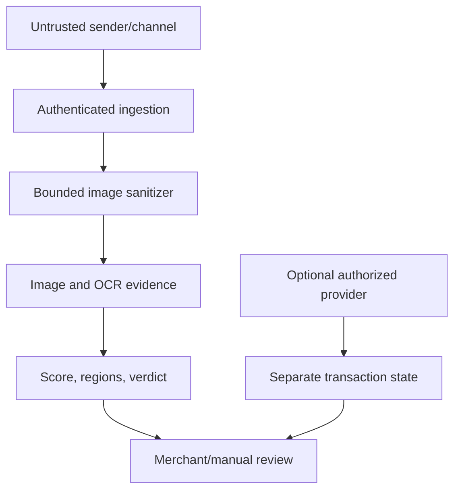

# VeriSlip research threat model and problem formulation

## Purpose and scope

This document defines the research problem addressed by VeriSlip: triaging a
submitted image of a purported bank-transfer slip for evidence of material
manipulation. It is a model of the current repository, not a claim of bank-side
transaction confirmation and not a guarantee that fraud can always be detected.

The operational setting is Sri Lankan person-to-person and merchant payment,
where a seller may receive a slip through a web upload, messaging application,
or commerce integration before releasing goods. English, Sinhala, and Tamil
text, mobile screenshots, photographed screens, and printed or scanned slips are
all realistic inputs.

## Formal problem statement

Let the latent, genuine document be an image

\[
G \in \{0,\ldots,255\}^{H \times W \times C}.
\]

An attacker applies a possibly local manipulation operator \(M_\theta\), with
parameters \(\theta\) and material region \(R\subseteq[1,H]\times[1,W]\):

\[
X = M_\theta(G;R).
\]

Both genuine and manipulated documents can pass through a benign acquisition
channel \(T_\phi\) (resize, JPEG recompression, screenshot, print--scan, camera
capture, or messaging transport). The verifier observes only

\[
Y=T_\phi(X)+\epsilon,
\]

where \(\epsilon\) represents sensor, display, compression, and OCR noise. For a
genuine observation, \(X=G\) and \(R=\varnothing\). This separation matters:
\(T_\phi\) may create strong artifacts without changing the payment meaning.

The system produces layer evidence \(e=(e_1,\ldots,e_k)\), a bounded risk score
\(s=f(e)\in[0,1]\), optional candidate regions \(\hat R\), and a triage decision

\[
d_\tau(Y)\in\{\text{authentic},\text{suspicious},
\text{high-risk},\text{inconclusive}\}.
\]

The decision is evidence about the **image**, not settlement truth. A future,
authorized Layer 5 provider may return a separate transaction match state; it
must not silently replace the image-forensic result.

### Research objectives

1. Detect material edits that change payment meaning while controlling false
   alerts under realistic benign transformations.
2. Localize suspicious regions when the available cue supports localization.
3. Preserve interpretable per-layer evidence and allow an inconclusive outcome.
4. Measure robustness across banks, languages, devices, acquisition channels,
   and attack skill levels without data leakage.

## Assets and security properties

| Asset | Desired property |
|---|---|
| Payment fields (amount, beneficiary/account, date, reference) | visible values have not been materially substituted |
| Image provenance evidence | acquisition and compression cues are reported without overstating certainty |
| Verification decision | score and verdict are reproducible, calibrated, and attributable to evidence |
| Merchant action | ambiguous or unavailable evidence does not become automatic approval |
| Receipt/customer data | images, OCR text, identifiers, and credentials remain confidential |
| Audit records | decisions are traceable without retaining unnecessary receipt content or PII |

## Actors and incentives

### Defender and relying party

The verifier processes an untrusted image. The merchant or reviewer decides
whether to release goods, request another proof, or use an independent bank
channel. Neither the merchant nor VeriSlip is assumed to control the sender's
device, the messaging channel's recompression, or the issuing bank's UI.

### Adversary profiles

| Profile | Plausible capabilities | Typical constraints |
|---|---|---|
| Novice | crop, overlay text, erase a field, reuse a slip, take a screenshot | limited artifact cleanup; commodity editor |
| Intermediate | matched font/color, local clone/inpaint, splice fields, recompress, recapture a screen | incomplete knowledge of detector thresholds and source pipeline |
| Expert | coordinated multi-field edit, artifact suppression, repeated query adaptation, high-quality print/screen recapture | still lacks trusted bank records and may not reproduce every acquisition trace |

The model does not assume that an attacker must leave one particular artifact.
Adaptive attackers may trade one cue for another and may learn from exposed
outputs. Rate limits and restrained explanations reduce, but do not eliminate,
oracle-style probing.

## Attack taxonomy

### Semantic field manipulation

- amount substitution, including digit replacement and decimal changes;
- beneficiary or account-number substitution;
- reference-number replacement or reuse;
- date/time alteration;
- status-label changes (for example, changing pending to successful);
- deletion or occlusion of fields that would contradict the claimed payment.

### Pixel and region manipulation

- copy--move of a glyph, number, status, or background patch;
- splicing from another slip or a clean UI reconstruction;
- local inpainting/erasure followed by re-rendered text;
- geometric adjustment, antialiasing, color matching, or blur to hide boundaries;
- metadata removal, global recompression, resizing, denoising, or sharpening;
- screenshot, screen recapture, print--scan, or camera recapture intended to wash
  out editing traces.

### Replay and contextual fraud

A genuine old slip can be replayed for a new order. The pixels may be authentic,
so image forensics alone cannot establish freshness, recipient ownership, or
settlement. OCR field comparison and an authorized transaction provider can
reduce this gap, but only when reference data and access are valid.

### Out-of-scope attacks

- compromise of a bank or payment-network system;
- a fully genuine transfer later reversed through an external process;
- malware controlling the merchant's device or VeriSlip host;
- social-engineering decisions unrelated to the submitted document;
- denial of service beyond the bounded upload/rate controls defined elsewhere.

## Trust boundaries and data flow

1. **Network boundary.** Upload bytes, filenames, MIME types, webhook fields, and
   remote media responses are attacker controlled. Authentication, rate limits,
   signature checks, timeouts, and bounded reads precede analysis where relevant.
2. **Decode boundary.** Only content-validated, size- and dimension-bounded,
   metadata-stripped raster images enter the pipeline. A successful decode does
   not imply authenticity.
3. **OCR boundary.** OCR tokens are uncertain observations. They may be missing,
   malformed, multilingual, or adversarial and must not be treated as bank truth.
4. **Forensic boundary.** Layer outputs are heterogeneous heuristic or model
   evidence. A low score is not proof of payment.
5. **External-provider boundary.** Any future transaction-verification adapter is
   independently authenticated, read-only, privacy-minimized, and failure-aware.
   `UNAVAILABLE` is not a mismatch and must not become a fraud verdict.
6. **Human/action boundary.** VeriSlip supplies decision support. The merchant
   retains a normal/manual path and should independently verify high-value or
   inconclusive cases.

## Current evidence model

| Boundary/evidence | What the current code can examine | What it cannot establish |
|---|---|---|
| Structural and OCR semantics | metadata, perspective/layout, bank/color hints, currency syntax, arithmetic, temporal and required-field rules | that OCR text is correct or that a transfer settled |
| Classical image forensics | recompression/ELA residuals, DCT periodicity, JPEG grids, copy--move, occlusion, thermal-fade distinctions | attacker intent; many transformations have benign causes |
| Noise and typography | local residual consistency, SRM responses, baseline/kerning and glyph-rasterization anomalies | PRNU camera identity or universal font authenticity |
| Layer 4 | optional dual-stream inference when compatible weights exist; otherwise an explicit heuristic fallback | validated generalization without a documented dataset/checkpoint evaluation |
| Future Layer 5 | provider-neutral contract and development mock only | live LankaPay/bank access, payment finality, or production authorization |

## Legitimate transformations and false positives

The null hypothesis must include more than untouched source pixels. Legitimate
slips may be cropped, resized, color-converted, recompressed multiple times,
rendered by different operating-system/font versions, captured from a display,
photographed at an angle, printed/scanned, or partially obscured by UI chrome.
Thermal paper may fade continuously. Accessibility settings and bank redesigns
may change layout or typography.

Evaluation should stratify these transformations and measure false-positive
rates separately. A detected artifact is an observation requiring corroboration,
not a synonym for fraud. Missing evidence should lower confidence or produce
`inconclusive`, rather than be converted to evidence of authenticity.

## Security and privacy assumptions

- Public inputs are hostile; filenames and declared content types are not trusted.
- The image sanitizer and endpoint-specific authentication/signature controls
  operate correctly and are not bypassed.
- Production keys and provider credentials are supplied outside the repository.
- Raw images and full OCR/PII values are not written to routine logs.
- Research data is collected with authorization, minimized, redacted where
  appropriate, access-controlled, and split without identity/template leakage.
- An attacker may know the architecture, but not production secrets or private
  calibration data.

## Goals, non-goals, and claim boundaries

### Intended claims after empirical validation

- the system can rank or triage specified manipulation classes under a stated
  dataset and acquisition protocol;
- selected layers can localize specified synthetic or consented edits;
- layer ablations quantify incremental value under that protocol.

### Claims this formulation does not permit

- “authentic” means a payment was settled;
- every forged, replayed, recaptured, or AI-edited slip is detectable;
- a bright ELA region or OCR mismatch proves fraud;
- repository unit tests or demo benchmark values establish field accuracy;
- support for one bank/template/device generalizes to all Sri Lankan banks;
- the repository currently has official LankaPay or bank-network connectivity.

## Evaluation protocol implied by the threat model

Report document-level precision/recall, ROC-AUC and PR-AUC where class counts
permit, plus region-level localization metrics for attacks with ground truth.
Include per-attack, per-bank, per-language, per-device, and per-acquisition
breakdowns; calibration error and abstention coverage; confidence intervals; and
false-positive rates on benign transformations. Use bank/template/device-aware
splits and disclose synthetic-versus-real composition. Compare ablations against
the complete ensemble. No performance number should be inserted until generated
from versioned inputs and a reproducible evaluation command.

## Residual risks

High-quality reconstruction may remove all observable local cues. Unknown bank
templates and OCR failures can cause abstention or false alerts. Recapture can
both create false positives and suppress genuine edit traces. An authentic image
can still describe the wrong transaction. These risks require conservative
language, manual review, and—where legally and contractually available—separate
read-only transaction verification.
